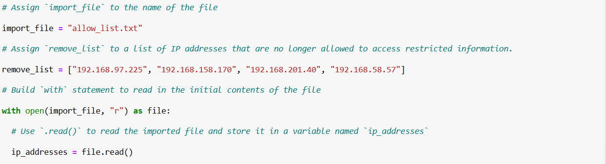
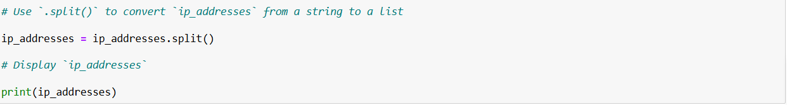
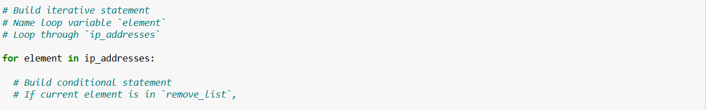
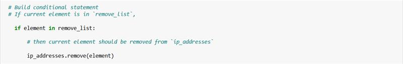
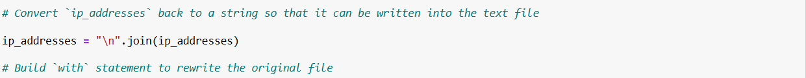
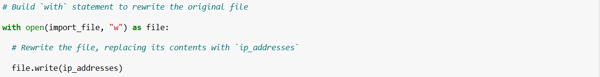
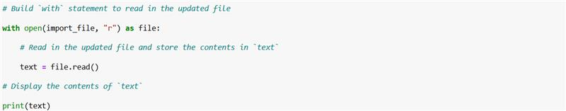

# Python Allow List Algorithm

This project contains a Python script that reads an IP allow list from a file, removes specified IP addresses, and updates the file with the revised list. It demonstrates practical use of Python string and list methods, loops, conditionals, and file input/output (I/O) to automate file management tasks.

## Project Description
In this project, I developed a Python algorithm to manage and update an IP allow list stored in a text file. The algorithm reads the contents of the file, processes the data to remove specified IP addresses, and then writes the updated list back to the file. I applied Python string and list methods, such as `.split()` and `.join()`, to convert between strings and lists for easy manipulation. Conditional statements and loops were used to identify and remove the IP addresses that should no longer be allowed. This project demonstrates how Python can be used to automate file management tasks and maintain accurate configuration files.

## Summary
The algorithm begins by reading the contents of the allow list file into a string variable. It then converts the string into a list so that individual IP addresses can be accessed and modified. A `for` loop iterates through the list, and a conditional statement with the `.remove()` method deletes IP addresses that are no longer allowed. After the removals, the list is converted back into a string with the `.join()` method, ensuring that each IP address is placed on its own line. Finally, the updated string is written back to the original file using a `with` statement and the `.write()` method. This approach ensures the allow list remains accurate, readable, and easy to maintain.

## Features
- Reads an IP allow list from a text file
- Converts between strings and lists for easier data manipulation
- Iterates through IP addresses to selectively remove unwanted entries
- Writes the revised list back to the file with each IP address on a new line
- Demonstrates use of Python methods such as `.split()`, `.join()`, and `.remove()`
- Uses `with` statements to safely manage file operations


## Screenshots

### Initial Allow List


### Convert String to List


### Iterate Through Allow List


### Remove IP Addresses on Remove List


### Convert List Back to String


### Rewrite File with Updated List


### Updated Allow List After Removal



## Usage
1. Clone the repository:
   ```bash
   git clone https://github.com/Harbey74/algorithm-for-file-update-in-python.git
